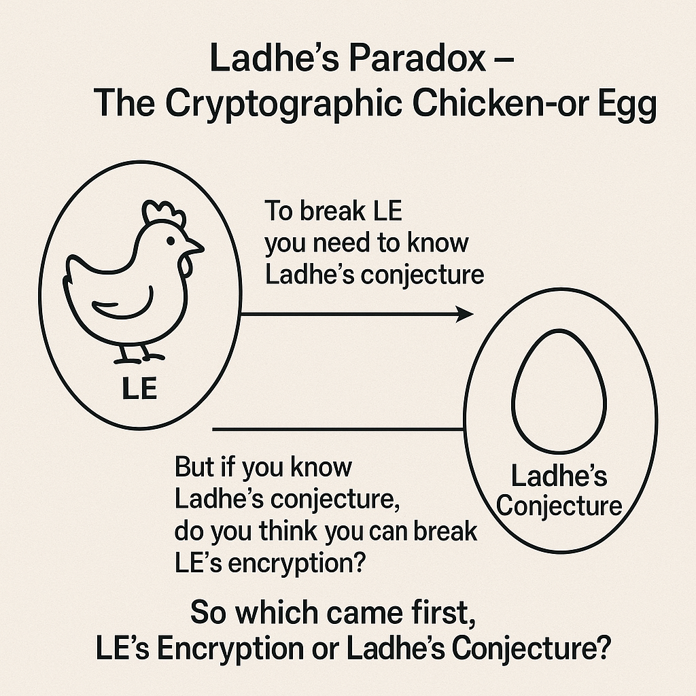

# 🧩 Ladhe’s Paradox – The Cryptographic Chicken-or-Egg

💡 What came first: Ladhe’s Encryption or Ladhe’s Conjecture?

•    To break Ladhe’s Encryption (LE), you need to know Ladhe’s Conjecture.
•    But if Ladhe’s Conjecture is true, does that necessarily imply LE is broken?
•    Yet, Ladhe’s Conjecture itself derives meaning only in the context of LE.

This forms a mutual dependency, much like how:

•    The egg (reproduction) depends on the chicken, but
•    The chicken had to come from the egg.
 
🔐 Philosophical/Cryptographic Implications

•    If Ladhe’s Conjecture is unpublished or unproven, then LE is secure by obscurity of the conjecture.
•    If the conjecture is published, it doesn’t immediately lead to breaking LE—unless the conjecture is proven constructively.
•    If LE was designed around the truth of the conjecture, it implies the encryption anticipates the conjecture’s limits.

Thus:

•    If LE anticipates the conjecture’s truth, then LE came after the conjecture (i.e., the egg came first).
•    But if LE gave rise to the need for the conjecture, then the encryption came first (i.e., the chicken came first).
 
🧠 A Deeper Thought

To break the encryption, you must understand the conjecture.

But to formulate the conjecture, you must understand the encryption.

This recursive loop is the essence of Ladhe’s Paradox. It may imply an **undecidable problem** in the Gedelian sense—or a cryptographic ratchet that protects itself via its own theoretical complexity.

