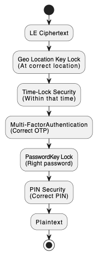

# 🔒 LE Hackathon findings submission.

Unlike traditional encryption methods like **RSA**, where discovering the two prime numbers effectively breaks the system, **Ladhe’s Encryption (LE)** offers **bulletproof protection** through its **layered architecture**.

---

## 🔐 LE Decoding Complexity Points Table

Each security layer adds exponential complexity for any adversary attempting to break the encryption:

|-------------------------|--------------|----------------------------------------------------------|
| Security Layer          | Points       | Description                                              |
|-------------------------|--------------|----------------------------------------------------------|
| Encrypt/Decrypt Math    | 40           | Advanced mathematics used to encrypt and decrypt the data|
| Finding Keys            | 10           | Involves locating Public and Private Keys                |                  
| Password Key Lock       | 15           | Requires a password-derived key or passphrase known only |
| Geo Location Key        | 15           | Must provide correct physical GPS coordinates            |
| MFA-OTP Code            | 10           | Requires valid multi-factor authentication (OTP code)    |
| Time-Lock               | 5            | Decryption allowed only during specific time windows     |
| Pin                     | 5            | Requires a 4 digit pin                                   |
|-------------------------|--------------|----------------------------------------------------------|

## 🧠 Think You Can Break LE? Submit Your Findings!

If you believe you've found a vulnerability or breakthrough, please submit your findings as per categories below:

| **LE Layer**                       | **Your Finding**         |
|------------------------------------|--------------------------|
| Encryption/Decryption Math         |                          |
| Keys – Public and Private (if any) |                          |
| Password                           |                          |
| Geo Locations and Distance         |                          |
| MFA-OTP Code                       |                          |
| Time-Lock                          |                          |
| Pin                                |                          |
| Plaintext                          |                          |
|------------------------------------|--------------------------|

