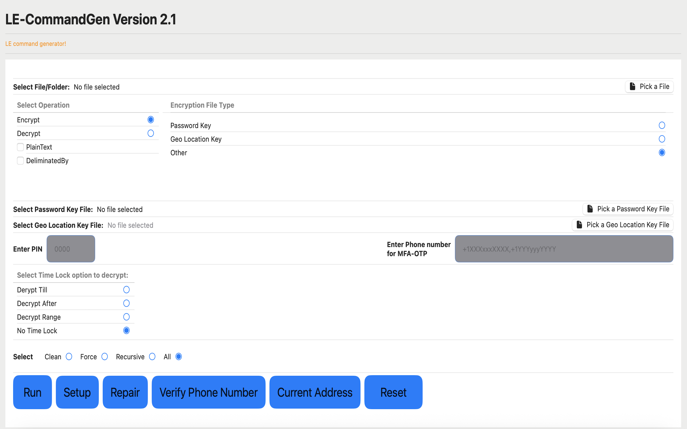
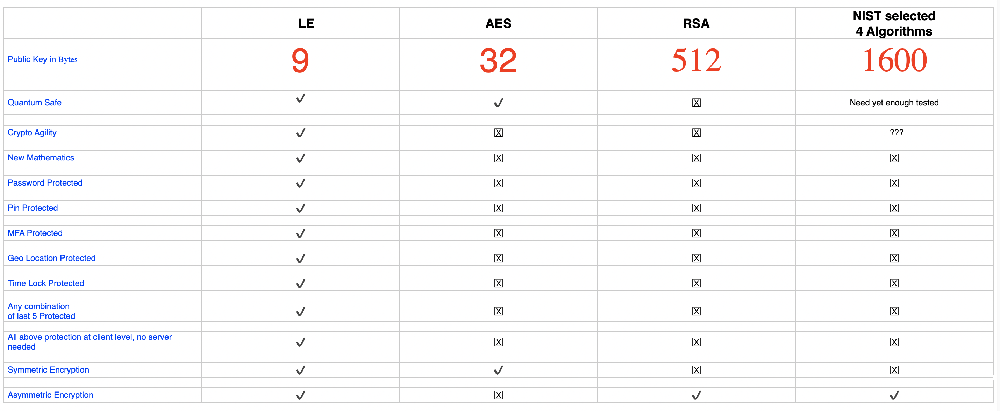

# 🔒 Ladhe’s Encryption Utility (LE)

## ✨ Version : 1.3

## ✨ Last Updated : 09/21/2025

Experience the next generation of **data security** with **Ladhe’s Encryption Utility (LE)**—a **cutting-edge, post- quantum-safe encryption tool** designed for **Mac Terminal**. Built with advanced features and unparalleled encryption power, **LE** ensures your sensitive data remains **protected** from modern and future threats.

Now that LE is **cross-platform**, you can encrypt and decrypt files seamlessly on both **macOS and Windows.**

**Open door hacking challenge!** LE secures your data, information, and files on your PC or server—even if hackers try to attack through the front door. Unlike traditional encryption, LE is built to withstand the rising threats of AI-powered attacks and future quantum computing capabilities.

**With LE, you’re not just protecting files—you’re helping to eradicate hacking and safeguard the digital world for the years to come.**

**Given Ladhe's Encryption, orgs/users and developers gain unmatched security.**

**When access requires a PasswordKey, is within a specified time range, and is restricted to a defined geo-locationKey,**

**Then only authorized users, at the right time and place, with correct pin and MFA/static OTP (non expiring) can unlock the data!**

---

## ✨ Key Features

### 🔑 Cross Platform, PasswordKey Lock Security, Pin Security, MFA Security,Time-Lock Security , Geo Location Key Security
- **Cross Platform Support**: Encrypt/Decrypt files in Mac/Windows OS seemlessly! **Make your files/folders LE Safe from AI/PQC/Classical threats!.
- **Password Encryption**: Encrypt files with a **secure PasswordKey file**.
- **Pin Encryption**: Encrypt files with a **4 digit pin**.
- **MFA Encryption**: Encrypt files with a **MFA or static OTP**.
- **Time-Lock Encryption**:
  - 🔹 **Decrypt only before** a specified date.
  - 🔹 **Decrypt only after** a specified date.
  - 🔹 **Decrypt within** a date range.
- **Geo Location Encryption**: Encrypt files with a **Geo Location file**.
- **LE-AIGPT** is LE AI powered command generator utility.No need to type **LE commands on terminal**, you can build LE command using this tool and just paste command in terminal window.

[LE-AIGPT in App Store!](https://apps.apple.com/by/app/le-aigpt/id6746082278)




**Either Pin or MFA should be enabled for PasswordKey/LocationKey file**

### 🗂 File & Folder Encryption
- **Encrypt/Decrypt Files & Folders**: Apply strong encryption to both files and directories.
- **Recursive Folder Encryption**: Encrypt entire directories with **subfolder support**.
- **Force Mode**: Overwrites existing encrypted files.
- **Clean Mode**: Restores **.leXXX** files to their **original** format upon decryption.
- **Trio Mode**: Use **Force, Clean, and Recursive** encryption in a single command.

We recommend that you encrypt the folder with recursive flag -j with same type of encryption we support. 
Otherwise, you will need to decrypt individual files one at a time.





### 🛡 Additional Features

- **Metadata & File Info**: Retrieve **detailed encryption metadata**.
- **.le ignore support**: You can configure .leignore to **exclude some files from LE**.
- **Auto-Generated Comments**: LE **embeds encryption details** into file properties.
- **Tamper Detection**: _(Licensed version)_ Prevents **date manipulation** using online validation.
- **Geo Location for any address**: _(Available in both Beta and Licensed version for now)_ **Pipeline proper geo location to build proper Geo Location file.**

- **File Size Limit**:
  - ⚡ **Beta Version**: Supports **up to 4MB**.
  - 🚀 **Licensed Version**: Supports **up to 100MB**.

- **Files Limit in Folder**:
  - ⚡ **Beta Version**: Supports **up to 2000 Files**.
  - 🚀 **Licensed Version**: Supports **up to 100,000 Files**.

- **Geo Locations Limit**:

  - ⚡ **Beta Version**: Supports **up to 5 Geo Locations**.
  - 🚀 **Licensed Version**: Supports **up to 100 Geo Locations**.

- **MFA/Static OTP Phone numbers Limit**:

  - ⚡ **Beta Version**: Supports **up to 2 Phone numbers**.
  - 🚀 **Licensed Version**: Supports **up to 5 Phone numbers**.

- **Number of unsuccessful attempts Limit**:

  - ⚡ **Beta Version**: 5 attempts**.
  - 🚀 **Licensed Version**: 25 attempts**.
              
    **File will be deleted once you exceed number of unsuccessful attempts limit**
---

## 📂 Supported File Extensions

LE currently supports encryption for the following file types, we are actively adding support for many more types of files:

| **Category**          | **File Extensions**                         |
|-----------------------|---------------------------------------------|
| **Text Files**        | `txt`, `rtf`, `csv`, `log`, `json`, `xml`   |
| **Image Files**       | `png`, `jpg` , `svg`                        |
| **Audio Files**       | `wav`,`mp3`,`aac`,`flac`,`aif`              |
| **Video Files**       | `mp4`,`mov`,`avi`,`wmv`,`mkv`,`webm`        |
| **Programming**       | `java`, `c`, `vb`, `cs`, `php`, `py`, `sql` |
| **Web Files**         | `html`, `htm`, `js`, `aspx`, `xhtml` , `md` |
| **Apple Development** | `storyboard`, `swift`, `xib`                |
| **Miscellaneous**     | `asp`, `class`, `m`, `h`                    |

**We almost support more than 900 types of files, if you need any extension that we don't support, please contact us.**
 
💡 **Need support for additional file types?** Please contact **spalgorithm@gmail.com**.

---

## 📂 Support .leignore

.leignore file is used to ignore the files and directories which are unnecessary to project this will
be ignored by the LE.

---
## 🎯 Why Choose LE?

🚀 **Ladhe’s Encryption Utility (LE)** is at the **forefront of post-quantum cryptography**, ensuring **future-proof** security for your sensitive data.

- 🔹 **Lightweight** & **Efficient** terminal-based encryption.
- 🔹 **Protects against modern and quantum-based attacks**.
- 🔹 **Advanced encryption** with **PasswordKey , time-lock , pin-lock , MFA lock, & GEO Location-lock** security.
- 🔹 **Beta Version** available for free for limited time, with **Licensed Version** offering extended features.

🔒 **Secure your files today with LE!** If you find it meets your needs, request a **licensed copy** to unlock even more powerful features. Contact **spalgorithm@gmail.com**.

---

# LE Encryption & Decryption Commands

## 🔹 Install Steps:

1. **Clone the repository** or **download the zip**:
   
```bash
git clone https://github.com/SPAlgorithm/LE.git
```
   Or download the zip and extract it.

2. **Install LE**:

   - Tap on **LE.dmg** and copy/move **LE** and **LE-AIGPT** to a local folder.
   
   - Double click on **LELocation shortcut** to enable permissions.
   

3. **Setup LE**:

```bash
./LE --setup
```
   Or:
```bash
./LE -s
```

If you run setup, then you are agreeing to all the terms and conditions! LE uses location and messages services, please
enable these if you are using Geo Location and MFA capabilities.
 
This will create a **`cer.le` certificate**. This will also create **.leignore** file in current folder. You may be prompted to enter password of your machine in key chain.
If you want to buy licenced copy,please share `cer.le` with us. Contact **spalgorithm@gmail.com**.

4. **Encrypt a test file**:

```bash
echo Testing > example.txt
```
   
```bash
./LE -e example.txt -j
```   
   
   You should see **example.letxt** in the folder.

---


# 🔒 LE Demo ...

🔑 Password Lock Security, Pin Security, MFA Security,Time-Lock Security , Geo Location Security

### 🔹 Encrypt & Decrypt a File with a Time Lock, Geo Location , 4 digit pin , MFA and PasswordKey


```bash
echo Testing > example.txt
```

```bash
./LE -e example.txt -l "2025/04/20 19:10" -r "2026/04/01 14:10" -b location.lecsv -w pass.letxt -1 1234 -2 "+1XXXXXXXXX,+1YYYYYYYYYY" -j
```

**Decrypt (within the allowed date range):**

To get OTP to your configured phone:

```bash
./LE -4 example.letxt -1 1234 
```

Use that OTP to decrypt :

```bash
./LE -d example.letxt -w pass.letxt -j -1 1234 -3 "123456"
```

## 🔹 Create a PasswordKey Encryption File

1. **Create a PasswordKey file**:

```bash
echo TestingPassword > pass.txt
```
   This PasswordKey file now contains the password `"TestingPassword"`.

2. **Encrypt the PasswordKey file**:

**The PasswordKey file needs to be encrypted/decrypted with 4 digit pin or  MFA enabled.**

```bash
./LE -e pass.txt -q -j -1 1234
```
   The PasswordKey file (pass.letxt) is now encrypted with pin 1234 and can be used for encrypting files or folders.

```bash
./LE -e pass.txt -q -j -1 1234 -2 "+1XXXXXXXXX,+1YYYYYYYYYY"
```


## 🔹 Create a Location key Encryption File

1. **Create a location key file**:

**Location files needs to be encrypted/decrypted with 4 digit pin.**


```bash
./LE -x "1 Infinite Loop. Cupertino, CA 95014 United States" -m 100 >> location.csv
```

```bash
./LE -x "1560 Broadway, Manhattan, NY 10036 usa" -m 500 >> location.csv
```
    
Location.csv will contain 2 Geo Location points now if valid addresses are provided.

2. **Encrypt the location key file**:


```bash
./LE -e location.csv -v -1 1234 -g -m 200 -j
```


```bash
./LE -i location.lecsv 
```

**Note: Please backup your .leignore file, repair will recreate .leignore file.**

This will recreate a `cer.le` certificate and clean up some of the current location information.You may be prompted
to enter password of your machine in key chain. 

---

Ladhe's Encryption can play a crucial role in mitigating the **Harvest Now, Decrypt Later (HNDL)** threat, which is a major concern in the era of quantum computing.

How Ladhe’s Encryption Solves HNDL

1.**Quantum-Safe from Day Zero**

Unlike classical RSA and ECC, which are vulnerable to Shor’s algorithm, Ladhe's Encryption is designed to be resistant to quantum attacks, making it an ideal defense against adversaries who collect encrypted data today with the hope of decrypting it in the future.

2.Unmatched Key Strength

Even Version 1.0 of Ladhe’s Encryption (with just a 9-byte public key) is trillions of times stronger than 4096-bit
RSA.This immense cryptographic strength ensures that data remains secure even against future advancements in computing
power.

3.**Dual Algorithm (Symmetric & Asymmetric Support)**

Supporting both symmetric and asymmetric encryption allows for dynamic adaptation, ensuring that even legacy systems can
transition to post-quantum security without sacrificing performance or compatibility.

4.**Crypto Agility**

Ladhe’s Encryption is designed for crypto agility, meaning it can be integrated into existing cryptographic infrastructures and updated as new threats emerge, preventing long-term vulnerabilities.
Resistant to Future Quantum Breakthroughs

Since it is not based on factorization, discrete logarithms, or elliptic curve cryptography, Ladhe’s Encryption does not
suffer from the weaknesses that quantum computers exploit.

Why Does This Matters?

Governments, enterprises, and individuals storing sensitive information today are at risk because encrypted data stolen
now can be decrypted later when quantum computers reach maturity. By adopting Ladhe’s Encryption now, organizations can
protect their critical data before it’s too late.

---

**Challenge to break LE**:

While Ladhe’s Encryption may be at stage ZERO, but we boldly challenge QUANTUM computers, AI, ChatGPT, and the world's
smartest minds to break it! Our goal is to keep world safer!

[LE Hackathon!](https://www.facebook.com/share/1FgtAyAM86/)


---

**Enjoy LE!**

© Ladhe's Encryption 2025! All rights reserved.

---

