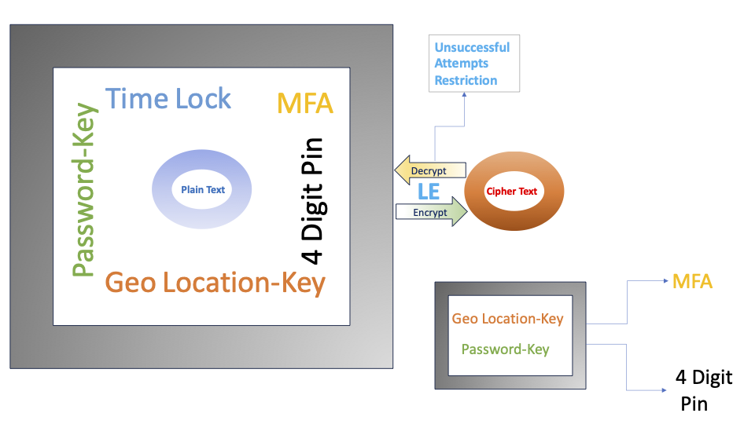

# 🔒 Ladhe’s Encryption Utility (LE)

## ✨ Version : 1.1

## ✨ Last Updated : 03/02/2025

Experience the next generation of **data security** with **Ladhe’s Encryption Utility (LE)**—a **cutting-edge, post- quantum-safe encryption tool** designed for **Mac Terminal**. Built with advanced features and unparalleled encryption power, **LE** ensures your sensitive data remains **protected** from modern and future threats.

**Given Ladhe's Encryption, orgs/users and developers gain unmatched security.**

**When access requires a password, is within a specified time range, and is restricted to a defined geo-location,**

**Then only authorized users, at the right time and place, with correct pin and MFA/static OTP (non expiring) can unlock the data!**

---

## ✨ Key Features

### 🔑 Password Lock Security, Pin Security, MFA Security,Time-Lock Security , Geo Location Security
- **Password Encryption**: Encrypt files with a **secure password file**.
- **Pin Encryption**: Encrypt files with a **4 digit pin**.
- **MFA Encryption**: Encrypt files with a **MFA or static OTP**.
- **Time-Lock Encryption**:
  - 🔹 **Decrypt only before** a specified date.
  - 🔹 **Decrypt only after** a specified date.
  - 🔹 **Decrypt within** a date range.
- **Geo Location Encryption**: Encrypt files with a **Geo Location file**.

**If you use MFA option, you must enable 4 digit pin option.**

### 🗂 File & Folder Encryption
- **Encrypt/Decrypt Files & Folders**: Apply strong encryption to both files and directories.
- **Recursive Folder Encryption**: Encrypt entire directories with **subfolder support**.
- **Force Mode**: Overwrites existing encrypted files.
- **Clean Mode**: Restores **.leXXX** files to their **original** format upon decryption.
- **Trio Mode**: Use **Force, Clean, and Recursive** encryption in a single command.



We recommend that you encrypt the folder with recursive flag -j with same type of encryption we support. 
Otherwise, you will need to decrypt individual files one at a time.

### 🛡 Additional Features

- **Metadata & File Info**: Retrieve **detailed encryption metadata**.
- **.le ignore support**: You can configure .leignore to **exclude some files from LE**.
- **Auto-Generated Comments**: LE **embeds encryption details** into file properties.
- **Tamper Detection**: _(Licensed version)_ Prevents **date manipulation** using online validation.
- **Geo Location for any address**: _(Available in both Beta and Licensed version for now)_ **Pipeline proper geo location to build proper Geo Location file.**

- **File Size Limit**:
  - ⚡ **Beta Version**: Supports **up to 4MB**.
  - 🚀 **Licensed Version**: Supports **up to 100MB**.

- **Files Limit in Folder**:
  - ⚡ **Beta Version**: Supports **up to 2000 Files**.
  - 🚀 **Licensed Version**: Supports **up to 100,000 Files**.

- **Geo Locations Limit**:

  - ⚡ **Beta Version**: Supports **up to 5 Geo Locations**.
  - 🚀 **Licensed Version**: Supports **up to 100 Geo Locations**.

- **MFA/Static OTP Phone numbers Limit**:

  - ⚡ **Beta Version**: Supports **up to 2 Phone numbers**.
  - 🚀 **Licensed Version**: Supports **up to 5 Phone numbers**.

---

## 📂 Supported File Extensions

LE currently supports encryption for the following file types, we are actively adding support for many more types of files:

| **Category**          | **File Extensions**                         |
|-----------------------|---------------------------------------------|
| **Text Files**        | `txt`, `rtf`, `csv`, `log`, `json`, `xml`   |
| **Programming**       | `java`, `c`, `vb`, `cs`, `php`, `py`, `sql` |
| **Web Files**         | `html`, `htm`, `js`, `aspx`, `xhtml` , `md` |
| **Apple Development** | `storyboard`, `swift`, `xib`                |
| **Miscellaneous**     | `asp`, `class`, `m`, `h`                    |

**We almost support more than 900 types of files, if you need any extension that we don't support, please contact us.**
 
💡 **Need support for additional file types?** Please contact **spalgorithm@gmail.com**.

---

## 📂 Support .leignore

.leignore file is used to ignore the files and directories which are unnecessary to project this will
be ignored by the LE.

---
## 🎯 Why Choose LE?

🚀 **Ladhe’s Encryption Utility (LE)** is at the **forefront of post-quantum cryptography**, ensuring **future-proof** security for your sensitive data.

- 🔹 **Lightweight** & **Efficient** terminal-based encryption.
- 🔹 **Protects against modern and quantum-based attacks**.
- 🔹 **Advanced encryption** with **password , time-lock , pin-lock , MFA lock, & GEO Location-lock** security.
- 🔹 **Beta Version** available for free for limited time, with **Licensed Version** offering extended features.

🔒 **Secure your files today with LE!** If you find it meets your needs, request a **licensed copy** to unlock even more powerful features. Contact **spalgorithm@gmail.com**.

---

# LE Encryption & Decryption Commands

## 🔹 Install Steps:

1. **Clone the repository** or **download the zip**:
   
```bash
git clone https://github.com/SPAlgorithm/LE.git
```
   Or download the zip and extract it.

2. **Install LE**:

   - Tap on **LE.dmg** and copy/move **LE** to a local folder.
   - Double click on **LELocation shortcut** to enable permissions.

3. **Setup LE**:

```bash
./LE --setup
```
   Or:
```bash
./LE -s
```

If you run setup, then you are agreeing to all the terms and conditions! LE uses location and messages services, please
enable these if you are using Geo Location and MFA capabilities.
 
This will create a `cer.le` certificate.You may be prompted to enter password of your machine in key chain.
If you want to buy licenced copy,please share `cer.le` with us. Contact **spalgorithm@gmail.com**.

4. **Encrypt a test file**:

```bash
echo Testing > example.txt
```
   
```bash
./LE -e example.txt -j
```   
   
   You should see **example.letxt** in the folder.

---

## 🔹 Create a Password Encryption File

1. **Create a password file**:

```bash
echo TestingPassword > pass.txt
```
   This password file now contains the password `"TestingPassword"`.

2. **Encrypt the password file**:

**The password file needs to be encrypted/decrypted with 4 digit pin , optional MFA enabled.**

```bash
./LE -e pass.txt -q -j -1 1234
```
   The password file (pass.letxt) is now encrypted with pin 1234 and can be used for encrypting files or folders.

```bash
./LE -e pass.txt -q -j -1 1234 -2 "+1XXXXXXXXX,+1YYYYYYYYYY"
```

The password file (pass.letxt) is now encrypted with pin 1234 and MFA where you will provide a valid phone
number (with +Country Code) where static otp can be send at the time of decrypting and can be used for encrypting files
or folders. If you use MFA option, you must use pin option. 

**Note: Please make sure that you have enabled messages app on your Mac.**


3. **Decrypt the password file**:

```bash
./LE -d pass.letxt -j -w TestingPassword -1 1234
```

To decrypt a password file, the user must **know the password** stored inside the password file.
Also,to decrypt a password file, the user must **4 digit pin**


```bash
./LE -4 pass.letxt -1 pin
```

To receive OTP, use above command.

```bash
./LE -d pass.letxt  -j -w TestingPassword -1 1234 -3 "123456"
```

To decrypt a password file, the user must **know the password** stored inside the password file.
Also,to decrypt a password file, the user must **4 digit pin**, static OTP (123456) send to your phone. 


---

## 🔹 Create a Location Encryption File

1. **Create a location file**:

**Location files needs to be encrypted/decrypted with 4 digit pin.**

If you know Latitude,Longitude and distance in meters:

```bash
echo "35.8538,-78.686,2000" > location.csv
```

```bash
echo "38.1233,-88.249,100" >> location.csv
```

   This location file now contains the array of geo locations `"Lattitude,Longitude,Distance to allow decrypt in meters".
**One Geo Location point per line.**

If you don'know Latitude and Longitude but have address:

You can build location file using precise Geo Points and distance using LE. You can append Geo location into location
file and build accurate location file.

```bash
./LE -x "1 Infinite Loop. Cupertino, CA 95014 United States" -m 100 >> location.csv
```

```bash
./LE -x "1560 Broadway, Manhattan, NY 10036 usa" -m 500 >> location.csv
```
    
Location.csv will contain 2 Geo Location points now if valid addresses are provided.
  
- **Geo Locations Limit**:

  - ⚡ **Beta Version**: Supports **up to 5 Geo Locations**.
  - 🚀 **Licensed Version**: Supports **up to 100 Geo Locations**.


2. **Encrypt the location file**:

**Without encrypted geo location point.**

```bash
./LE -e location.csv -v -1 1234 -j
```

The location file (location.lecsv) is now encrypted with pin 1234 and can be used for geo location encrypting files or folders.It does not include current location, only geo points you specified. 
   
**With encrypted geo location point and custom distance.**

To add current location of enryption and distance of 200 meters to your list 

```bash
./LE -e location.csv -v -1 1234 -g -m 200 -j
```

To Encrypt location file with pin and MFA :


```bash
./LE -e location.csv -v -1 1234 -j -2 "+1XXXXXXXXX,+1YYYYYYYYYY"
```

The location file (location.lecsv) is now encrypted with pin 1234 and can be used for geo location encrypting files or folders.It will add current geo location and distance of 200 meters.

**Get Info on encrypted location file**

```bash
./LE -i location.lecsv 
```

3. **Decrypt the location file**:

```bash
./LE -d location.lecsv -j -1 1234
```

You will need a valid pin to decrypt location file.

```bash
./LE -d location.lecsv -j -1 1234 -3 "123456"
```

You will need a valid pin and static OTP (123456) send to valid phone number you provided to decrypt location file.

**Note: Please make sure that you have enabled locations on your Mac.**

---

# LE Encryption & Decryption Workflows

## 🔹 1. Basic Encryption & Decryption
### 🔹 Encrypt & Decrypt a File

**Encrypt:**
```bash
./LE -e example.txt -j
```

**Decrypt:**
```bash
./LE -d example.letxt -j
```

### 🔹 Encrypt & Decrypt a Folder

**Encrypt:**
```bash
./LE -e my_folder -j
```

**Decrypt:**
```bash
./LE -d my_folder -j
```

**Encrypt with Pin:**
```bash
./LE -e example.txt -j  -1 1234
```

**Decrypt with Pin:**
```bash
./LE -d example.letxt -j -1 1234
```

### 🔹 Encrypt & Decrypt a Folder

**Encrypt with Pin:**
```bash
./LE -e my_folder -j -1 1234
```

**Decrypt with Pin:**
```bash
./LE -d my_folder -j -1 1234
```

---

## 🔹 2. Encryption & Decryption with Password Protection
### 🔹 Encrypt & Decrypt a File with a Password

**Encrypt:**
```bash
./LE -e example.txt -w pass.letxt -j
```

**Decrypt:**
```bash
./LE -d example.letxt -w pass.letxt -j
```

### 🔹 Encrypt & Decrypt a Folder with a Password

**Encrypt:**
```bash
./LE -e my_folder -w pass.letxt -j
```

**Decrypt:**
```bash
./LE -d my_folder -w pass.letxt -j
```

---

## 🔹 3. Encryption & Decryption with Time Lock
### 🔹 Encrypt & Decrypt a File Until a Specific Date

**Encrypt (available for decryption after this date):**

```bash
./LE -e example.txt -t "2025/01/31 19:10" -j
```

**Decrypt (after the specified date):**

```bash
./LE -d example.letxt -j
```

### 🔹 Encrypt & Decrypt a Folder Until a Specific Date

**Encrypt (available for decryption after this date):**

```bash
./LE -e my_folder -t "2025/01/31 19:10" -j
```

**Decrypt (after the specified date):**

```bash
./LE -d my_folder -j
```

### 🔹 Encrypt & Decrypt a File From a Specific Date

**Encrypt (only decryptable after this date):**

```bash
./LE -e example.txt -l "2025/01/31 19:10" -j
```

**Decrypt (after the specified date):**

```bash
./LE -d example.letxt -j
```

### 🔹 Encrypt & Decrypt a Folder From a Specific Date

**Encrypt (only decryptable after this date):**

```bash
./LE -e my_folder -l "2025/01/31 19:10" -j
```

**Decrypt (after the specified date):**

```bash
./LE -d my_folder -j
```

### 🔹 Encrypt & Decrypt a File with a Date Range

**Encrypt (only decryptable between the specified dates):**

```bash
./LE -e example.txt -l "2025/01/31 19:10" -r "2026/02/01 14:10" -j
```

**Decrypt (within the allowed date range):**

```bash
./LE -d example.letxt -j
```

### 🔹 Encrypt & Decrypt a Folder with a Date Range

**Encrypt (only decryptable between the specified dates):**

```bash
./LE -e my_folder -l "2025/01/31 19:10" -r "2026/02/01 14:10" -j
```

**Decrypt (within the allowed date range):**

```bash
./LE -d my_folder -j
```

---

## 🔹 4. Encryption & Decryption with Password & Time Lock
### 🔹 Encrypt & Decrypt a File with a Password Until a Specific Date

**Encrypt (only decryptable after this date with a password):**

```bash
./LE -e example.txt -w pass.letxt -t "2025/01/31 19:10" -j
```

**Decrypt (with password after the specified date):**

```bash
./LE -d example.letxt -w pass.letxt -j
```

### 🔹 Encrypt & Decrypt a Folder with a Password Until a Specific Date

**Encrypt (only decryptable after this date with a password):**

```bash
./LE -e my_folder -w pass.letxt -t "2025/01/31 19:10" -j
```

**Decrypt (with password after the specified date):**

```bash
./LE -d my_folder -w pass.letxt -j
```

---

## 🔹 5. Encryption & Decryption with Geo Location Protection
### 🔹 Encrypt & Decrypt a File with a Geo Location

**Encrypt:**

```bash
./LE -e example.txt -b location.lecsv -j
```

**Decrypt:**

```bash
./LE -d example.letxt -j
```

### 🔹 Encrypt & Decrypt a Folder with a Geo Location

**Encrypt:**

```bash
./LE -e my_folder -b location.lecsv -j
```

**Decrypt:**

```bash
./LE -d my_folder -j
```

---

### 🔹 Encrypt & Decrypt a File with a Geo Location and password 

**Encrypt:**

```bash
./LE -e example.txt -b location.lecsv -w pass.letxt  -j
```

**Decrypt:**

```bash
./LE -d example.letxt -w pass.letxt -j
```

### 🔹 Encrypt & Decrypt a Folder with a Geo Location and password 

**Encrypt:**

```bash
./LE -e my_folder -b location.lecsv -w pass.letxt -j
```

**Decrypt:**

```bash
./LE -d my_folder -w pass.letxt -j
```

---

### 🔹 Encrypt & Decrypt a File with a Time Lock, Geo Location and password 

**Encrypt:**

```bash
./LE -e example.txt -b location.lecsv -w pass.letxt  -j
```

**Decrypt:**

```bash
./LE -d example.letxt -w pass.letxt -j
```

### 🔹 Encrypt & Decrypt a Folder with a Geo Location and password 

**Encrypt:**

```bash
./LE -e my_folder -b location.lecsv -w pass.letxt -j
```

**Decrypt:**

```bash
./LE -d my_folder -w pass.letxt -j
```

---

### 🔹 Encrypt & Decrypt a File Until a Specific Date with a Geo Location and password 

**Encrypt (available for decryption after this date):**

```bash
./LE -e example.txt -t "2025/03/31 19:10" -b location.lecsv -w pass.letxt -j
```

**Decrypt (after the specified date):**

```bash
./LE -d example.letxt -w pass.letxt -j
```

### 🔹 Encrypt & Decrypt a Folder Until a Specific Date with a Geo Location and password

**Encrypt (available for decryption after this date):**

```bash
./LE -e my_folder -t "2025/03/31 19:10" -b location.lecsv -w pass.letxt -j
```

**Decrypt (after the specified date):**

```bash
./LE -d my_folder -w pass.letxt -j
```

### 🔹 Encrypt & Decrypt a File From a Specific Date with a Geo Location and password

**Encrypt (only decryptable after this date):**

```bash
./LE -e example.txt -l "2025/02/20 19:10" -b location.lecsv -w pass.letxt -j
```

**Decrypt (after the specified date):**

```bash
./LE -d example.letxt -w pass.letxt -j
```

### 🔹 Encrypt & Decrypt a Folder From a Specific Date with a Geo Location and password

**Encrypt (only decryptable after this date):**

```bash
./LE -e my_folder -l "2025/02/20 19:10" -b location.lecsv -w pass.letxt -j
```

**Decrypt (after the specified date):**

```bash
./LE -d my_folder -w pass.letxt -j
```

### 🔹 Encrypt & Decrypt a File with a Date Range with a Geo Location and password
**Encrypt (only decryptable between the specified dates):**

```bash
./LE -e example.txt -l "2025/02/20 19:10" -r "2026/02/01 14:10" -b location.lecsv -w pass.letxt -j
```

**Decrypt (within the allowed date range):**

```bash
./LE -d example.letxt -w pass.letxt -j
```

### 🔹 Encrypt & Decrypt a Folder with a Date Range with a Geo Location and password
**Encrypt (only decryptable between the specified dates):**

```bash
./LE -e my_folder -l "2025/02/20 19:10" -r "2026/02/01 14:10" -b location.lecsv -w pass.letxt -j
```

**Decrypt (within the allowed date range):**

```bash
./LE -d my_folder -w pass.letxt -j
```

---

## 🔹 6. Get Info on encrypted file and folders
### 🔹 Info on a File 

**GetInfo File:**

```bash
./LE -i example.letxt
```

**GetInfo Folder:**

```bash
./LE -i my_folder -j
```

---

7. **Repair LE**:

```bash
./LE --repair
   ```
Or:

```bash
./LE -y
```

This will recreate a `cer.le` certificate and clean up some of the current location information.You may be prompted
to enter password of your machine in key chain.

---

Ladhe's Encryption can play a crucial role in mitigating the **Harvest Now, Decrypt Later (HNDL)** threat, which is a major concern in the era of quantum computing.

How Ladhe’s Encryption Solves HNDL

1.**Quantum-Safe from Day Zero**

Unlike classical RSA and ECC, which are vulnerable to Shor’s algorithm, Ladhe's Encryption is designed to be resistant to quantum attacks, making it an ideal defense against adversaries who collect encrypted data today with the hope of decrypting it in the future.

2.Unmatched Key Strength

Even Version 1.0 of Ladhe’s Encryption (with just a 9-byte public key) is trillions of times stronger than 4096-bit
RSA.This immense cryptographic strength ensures that data remains secure even against future advancements in computing
power.

3.**Dual Algorithm (Symmetric & Asymmetric Support)**

Supporting both symmetric and asymmetric encryption allows for dynamic adaptation, ensuring that even legacy systems can
transition to post-quantum security without sacrificing performance or compatibility.

4.**Crypto Agility**

Ladhe’s Encryption is designed for crypto agility, meaning it can be integrated into existing cryptographic infrastructures and updated as new threats emerge, preventing long-term vulnerabilities.
Resistant to Future Quantum Breakthroughs

Since it is not based on factorization, discrete logarithms, or elliptic curve cryptography, Ladhe’s Encryption does not
suffer from the weaknesses that quantum computers exploit.

Why Does This Matters?

Governments, enterprises, and individuals storing sensitive information today are at risk because encrypted data stolen
now can be decrypted later when quantum computers reach maturity. By adopting Ladhe’s Encryption now, organizations can
protect their critical data before it’s too late.

---

**Challenge to break LE**:

While Ladhe’s Encryption may be at stage ZERO, but we boldly challenge QUANTUM computers, AI, ChatGPT, and the world's
smartest minds to break it! Our goal is to keep world safer!

[LE Hackathon!](https://www.facebook.com/share/161epYoBB7/?mibextid=wwXIfr)
 
---

**Enjoy LE!**

© Ladhe's Encryption 2025! All rights reserved.

---
